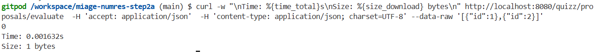

# Q1 : Décrire ce que renvoie la méthode qui liste les questions ?
Réponse:
Pour chaque question, la méthode listQuestion renvoie une liste d’objets de type QuestionDto. Chaque QuestionDto est associé aux données des questions concernées. Les données sont transmises sous forme de fichier JSON et pour récupérer toutes les questions disponibles, cette méthode appelle le service quizzservice.
# Q2 : Décrire ce que renvoie la méthode qui liste les propositions d'une question ?
Réponse:
la méthode listProposals renvoie une liste d’objets de type ProposalDto. Chaque objet correspond à une proposition d’une question donnée, identifiée par son identifiant id. Les propositions sont également fournies sous forme de JSON. 
# Q3 : Décrire ce que renvoie la méthode qui évalue des réponses ?
Réponse:
Par conséquent, la méthode retourne 0, c’est-à-dire que les propositions transmises – id: 1 et id:2 – n’étaient pas les bonnes. 
# Q4 : Quelle est la valeur de la RSS utilisée par l'api quarkus en mode JVM ?
Réponse:
216424
# Q5: Quel est le temps et la taille de la réponse  de la méthode qui liste les questions
Temps:23.678254s
Taille:883 bytes

# Q6: Quel est le temps et la taille de la réponse  de la méthode qui liste les propositions d'une question
Temps:12.770419s
Taille:609 bytes

# Q7: Quel est le temps et la taille de la réponse  de la méthode qui évalue les réponses
Temps:0.015602s
Taille:1 bytes

# Q8 : Empreinte mémoire en mode natif ?
Réponse:
76876
# Q9: Temps et  taille  réponse   liste les questions
Temps:26.719050s
Taille:883 bytes

# Q10: Temps et  taille  réponse  liste des propositions
Temps:15.490731s
Taille:609 bytes

# Q11: Temps et  taille  réponse  évaluation les réponses
Temps:0.001920s
Taille:1 bytes

# Q12:  Proposition 1
Description:Supprimer les imports inutilisés 
Temps:0.001632s
Taille:1 bytes

# Q13:  Proposition 2
Description:
Temps:
Taille:

# Q14:  Proposition 3
Description:
Temps:
Taille:

# Q15:  Proposition 4
Description:
Temps:
Taille: